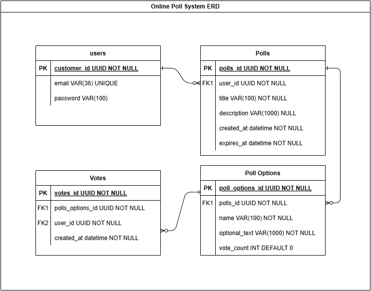
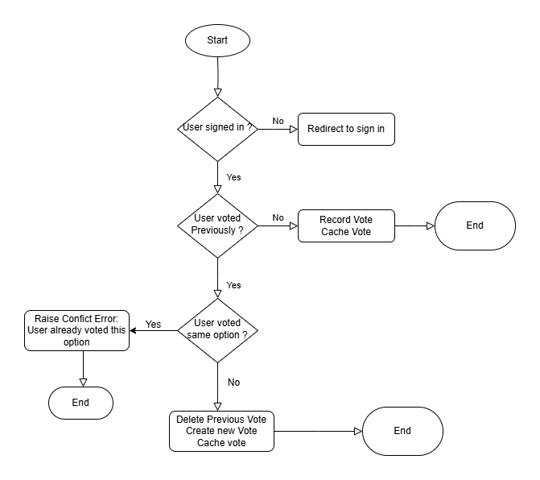

# **Technical Documentation: Online Polling System**  
**Version:** 1.0  
**Author:** Maduagwu Valentine  
**Date:** 18th March 2023  
**STATUS:** IN PROGRESS

---

## **1. Introduction**  
### **1.1 Overview**  
The **Online Polling System** is a web application designed to facilitate user-driven polls with real-time vote updates. Users can create polls, vote on different options, and view live results.  

The system is built with **Next.js**, utilizing a **MySQL database** with **TypeORM** for database management. Authentication is handled using **JWT (JSON Web Tokens)**, and **WebSockets** enable real-time vote streaming.  

### **1.2 Objectives**  
- Provide a seamless user experience for polling.  
- Ensure efficient handling of votes with caching (Memory Cache or Redis).  
- Stream live vote updates using WebSockets.  
- Maintain security with JWT-based authentication.  

---

## **2. System Architecture**  

### **2.1 Tech Stack**  
| Component         | Technology Used |
|------------------|----------------|
| **Frontend**     | Next.js |
| **Backend**      | NestJS |
| **Database**     | MySQL (TypeORM) |
| **Authentication** | JWT |
| **Caching**      | Memory Cache / Redis |
| **Real-time Updates** | WebSockets |
| **Deployment**   | docker |

### **2.2 Entity-Relationship Diagram (ERD)**  
The system follows a **relational database model** with the following main entities:  
- **Users**: Stores user credentials and authentication data.  
- **Polls**: Represents created polls, linked to users.  
- **Poll Options**: Contains available options for each poll.  
- **Votes**: Stores user votes for specific poll options.  

📌 **ERD Diagram:**  
   

---

## **3. Authentication & Security**  
### **3.1 User Authentication**  
- **JWT (JSON Web Token) Authentication** is used for session management.  
- On login, the server issues a signed JWT token, which the client uses for API requests.  
- Tokens expire after a set period and must be refreshed for continued access.  

### **3.2 Security Considerations**  
- **Password Hashing:** Passwords are securely hashed using bcrypt.  
- **JWT Best Practices:** Short-lived tokens with refresh token implementation.  
- **Input Validation:** Prevents SQL Injection & XSS attacks.  

---

## **4. Polling & Voting Logic**  
### **4.1 Flow of a Vote**  
- A **signed-in user** can vote on a poll.  
- If a user has already voted:  
  - If voting for the **same option**, a **conflict error** is raised.  
  - If changing the vote, the **previous vote is deleted**, and a new vote is recorded.  
- Every vote is **cached** (Memory Cache / Redis) before being persisted in the database.  

📌 **Voting Flowchart:**  
   

### **4.2 Caching Strategy**  
Votes can be cached using:  
1. **Memory Cache** (for quick access within the same instance).  
2. **Redis** (recommended for scalability & distributed systems).  

### **4.3 WebSockets for Live Voting Updates**  
- When a vote is cast or changed, an **event is triggered**.  
- WebSockets broadcast real-time polling data to all connected users in a poll room.  
- Ensures a smooth and interactive user experience.  

---

## **5. Database Schema & API Endpoints**  

### **5.1 Database Schema (Simplified)**  
| Table | Description |
|-------|------------|
| **users** | Stores user information (email, password). |
| **polls** | Contains poll details (title, description, created_at, expires_at). |
| **poll_options** | Lists available voting options for each poll. |
| **votes** | Stores user votes, tracking poll options selected. |

### **5.2 API Endpoints (Sample)**  
| Method | Endpoint | Description |
|--------|---------|-------------|
| `POST` | `/auth/register` | Register a new user |
| `POST` | `/auth/login` | User authentication (JWT) |
| `GET` | `/polls` | Fetch all polls |
| `POST` | `/polls` | Create a new poll |
| `GET` | `/polls/:id` | Get poll details |
| `POST` | `/vote` | Cast a vote |

---

## **6. Design Decisions & Justifications**  
### **6.1 Why Next.js?**  
- **Challenge & Learning:** After working with Laravel, Express, and Django, I wanted to explore a new technology.  

### **6.2 Why JWT for Authentication?**  
- Stateless authentication allows easy scalability.  
- Secure and widely used for API-based authentication.  

### **6.3 Why MySQL & TypeORM?**  
- **MySQL:** Relational structure is ideal for structured polling data.  
- **TypeORM:** Provides an abstraction layer for database management with NestJS.  

### **6.4 Why WebSockets?**  
- Needed for **real-time vote updates**.  
- Ensures users in a poll room see instant changes.  

---

## **7. Future Improvements**  
- Implement OAuth authentication (Google).  
- Add a background job processor for handling large vote updates efficiently.  
- Implement a ranking system for poll popularity.  

---

## **8. Conclusion**  
This document outlines the **technical architecture, design decisions, and implementation strategy** for the Online Polling System. It serves as a reference for backend development and future enhancements.  

---